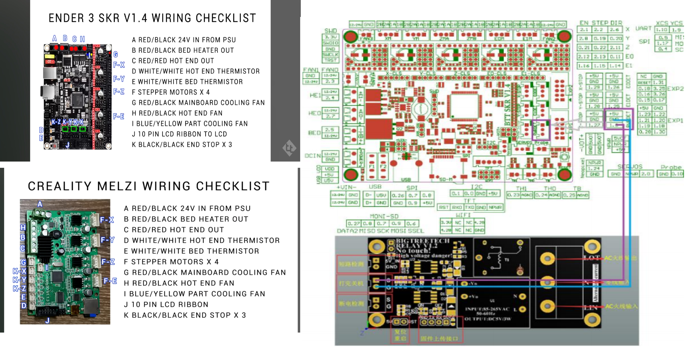
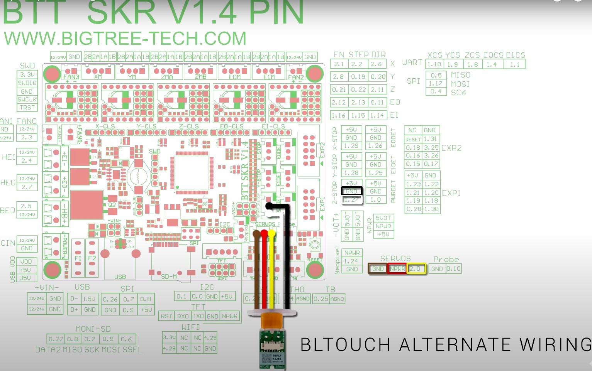

# Wiring Guide for the BigTreeTech SKR V1.4 Board

This guide provides the diagrams and necessary steps to wire the **BigTreeTech SKR V1.4** mainboard, commonly used for upgrading 3D printers like the **Creality Ender 3**.

---

## 🧰 1. Main Wiring Diagram

Below is a checklist for the **main connections** on the SKR V1.4 board. Ensure you plug the correct wires into the correct ports to avoid damaging the board.

| Label | Connection Description                            |
|-------|----------------------------------------------------|
| A     | Red/Black 24V wire from the Power Supply Unit (PSU) |
| B     | Red/Black wire for the Bed Heater                 |
| C     | Red/Black wire for the Hot End Heater             |
| D     | White/White wire for the Hot End Thermistor       |
| E     | White/White wire for the Bed Thermistor           |
| F     | Stepper Motors x4                                 |
| G     | Mainboard Cooling Fan                             |
| H     | Hot End Cooling Fan                               |
| I     | Part Cooling Fan                                  |
| J     | 10-Pin Cable for the LCD                          |
| K     | End Stops x3 (X, Y, Z axes)                       |

### 🖼️ Main Board Wiring Diagram  

---

## 📌 2. BLTouch/CRTouch Wiring (Alternate Method)

The diagram below describes an alternate wiring method for the **BLTouch/CRTouch sensor**, using the dedicated `SERVOS` and `Probe` ports on the board.

### 🔌 Connections:

#### SERVOS Port (3 wires):
- **Brown** → GND  
- **Red** → +5V  
- **Orange** → SIG (Signal)

#### PROBE Port (2 wires):
- **Black** → GND  
- **White** → Signal  

> ⚠️ Note: The Probe port also acts as the Z-min end stop.

### 🖼️ CRTouch/BLTouch Wiring Diagram  

---

## 🎥 3. Detailed Video Guide

For a visual reference and a full step-by-step tutorial, watch the installation guide on YouTube. It covers wiring, jumper settings, Marlin firmware configuration, and accessories.

📺 **[Watch on YouTube: BigTreeTech SKR V1.4 & V1.4 Turbo Installation Guide](https://www.youtube.com/watch?v=-Gdk0wHg51w)**

### ⏱️ Key Topics in the Video:
- **[00:00:54]** Introduction and comparison with older versions  
- **[00:06:46]** Wiring and physical installation guide  
- **[00:08:26]** Marlin firmware configuration steps  
- **[00:11:27]** Installing/configuring stepper motor drivers (A4988, TMC2208, TMC2209)  
- **[00:16:49]** Connecting accessories (TFT screen, BLTouch, etc.)  

> 🔄 The video suggests using the **Z-min port** for BLTouch, which is **different** from the alternate method shown above.

---

## 📝 Notes

- Always power off your printer before connecting/disconnecting any wires.
- Double-check all connections before powering on.
- Refer to the official BigTreeTech documentation for the latest hardware updates.

---
